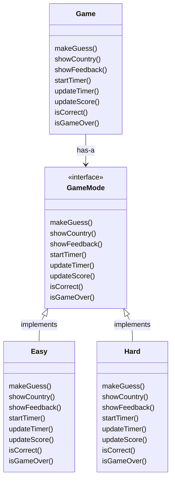
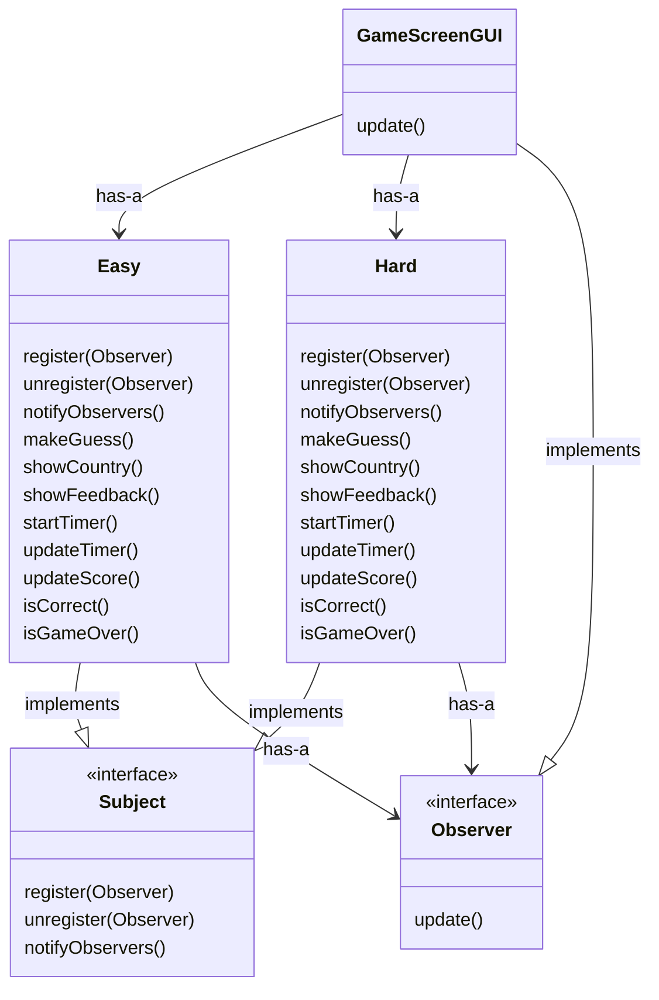
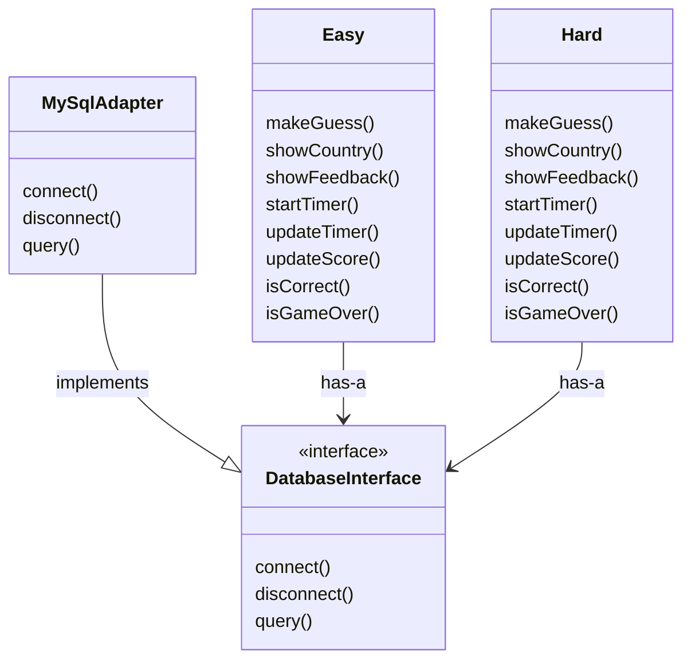

# Strategy Design Pattern
## Geo Quest will utilize the strategy design pattern for its Easy and Hard game modes. Both the Easy and Hard classes will implement the GameMode interface. The Game class will contain a GameMode object and call methods on the GameMode object. Including this level of abstraction in the design allows for a streamlined way of including future game modes in the application.

# Observer Design Pattern
## Geo Quest will utilize the observer design pattern to create a relationship between the game mode classes and the game screen. The Easy and Hard classes will be the concrete subjects and the GameScreenGUI class will be the concrete observer. The Easy and Hard classes will register the GameScreenGUI as an observer, and upon user input GameScreenGUI will call update on the game mode class it contains.

# Adapter Design Pattern
## Geo Quest will utilize the adapter design pattern to ensure the game has database flexibility in the future.  The MySqlAdapter class will implement the DatabaseInterface. Each game mode class, Easy and Hard, will contain a DatabaseInterface object. This allows another database to be easily incorporated into the game later in development.

