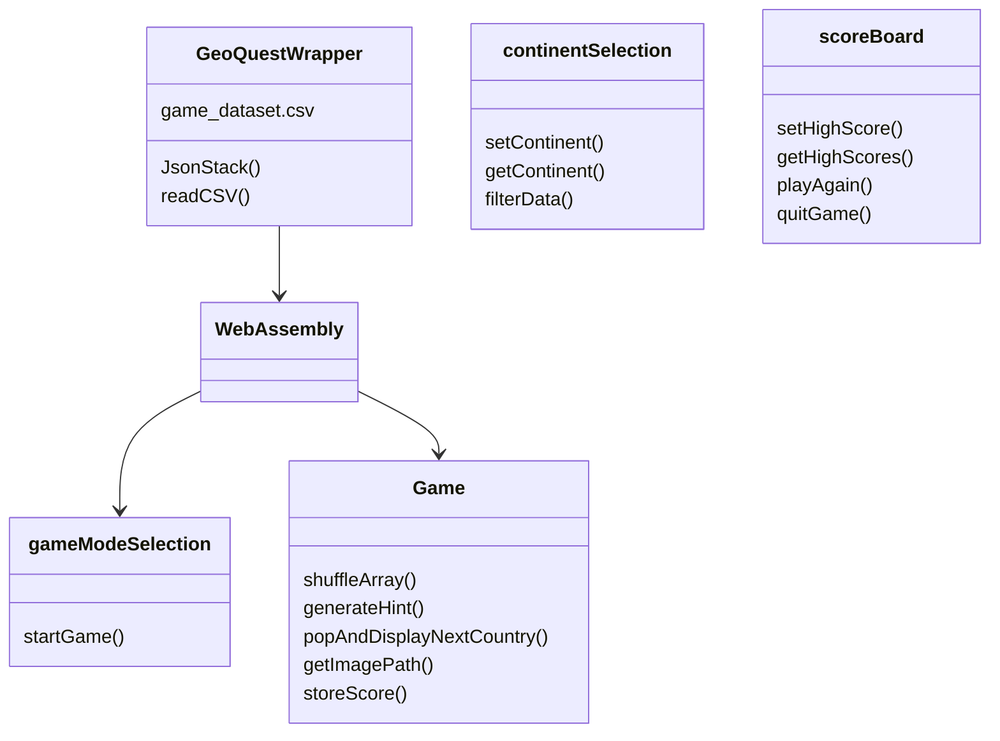
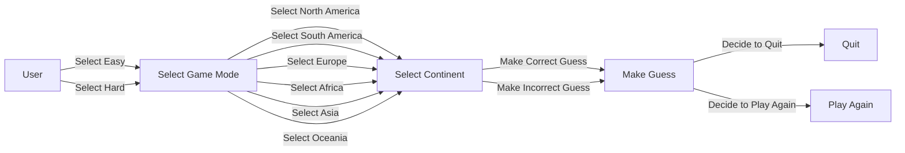
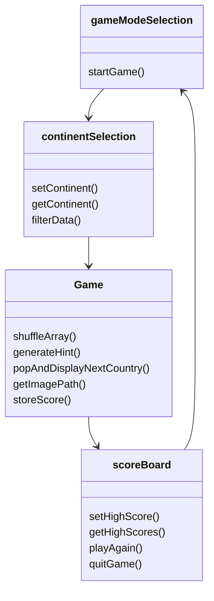

# Logical View
## Emscripten is used to compile c++ code to WebAssembly which is called by the Game Mode Selection Screen and the Game Screen. The Continent Selection Screen and the Score Board Screen are not directly connected to the backend logic, and therefore, are stand-alone components in the logical view. 

# Use Case Diagram
## This diagram demonstrates how a user interacts with the GeoQuest software. It walks through how a user would play the game.

# GUI Routing
## This diagram demonstrates how the GUI components of GeoQuest are routed from one component to the next.

